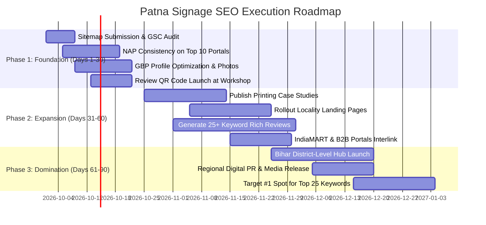

# PATNA SIGNAGE — GOOGLE SEARCH #1 RANKING MASTER PLAN
**Complete Blueprint for Organic Search & Google Maps (GBP 3-Pack) Domination in Patna, Bihar & Jharkhand**

---

## 🎯 1. Executive Summary & Ranking Objectives

This document establishes the strategic, technical, and content roadmap to rank **Patna Signage** (`patnasignage.com`) at **Position #1 on Google Organic Search** and within the **Top 3 of the Google Maps Local Pack** for all commercial signage and commercial printing queries across Patna, greater Bihar, and Jharkhand.

### Primary Ranking Goals:
| Benchmark | Target Horizon | Target Metric |
| :--- | :--- | :--- |
| **Google Maps Local Pack (3-Pack)** | 30 – 45 Days | #1 – #3 in Patna (Fraser Rd, Boring Rd, Bailey Rd, Kankarbagh) |
| **Core High-Intent Keywords** | 60 – 90 Days | Top 3 organic ranking for 25+ primary commercial keywords |
| **New Printing Services Keywords** | 45 – 75 Days | First page ranking for flex, banner, offset, and vinyl searches |
| **Monthly Inbound Leads** | 90 Days | 150+ monthly calls & WhatsApp inquiries via Organic & GBP |

---

## 🔑 2. Keyword Matrix & Search Intent Architecture

Search queries are segmented into **Transaction/Commercial Intent** (high immediate conversion) and **Informational/Locality Intent** (traffic and authority builders).

### Category A: Core Signage Keywords (High Commercial Value)
| Keyword | Monthly Search Volume (Bihar) | Intent | Target Landing Page | Priority |
| :--- | :--- | :--- | :--- | :--- |
| `sign board manufacturer in patna` | High | Commercial | `/` (Home) | **Tier 1** |
| `sign board maker patna` | High | Commercial | `/` (Home) | **Tier 1** |
| `led sign board patna` | Very High | Transactional | `/services/led-signage` | **Tier 1** |
| `3d acrylic letters patna` | High | Transactional | `/services/3d-letters` | **Tier 1** |
| `acp sign board patna` | High | Transactional | `/services/acp-signage` | **Tier 1** |
| `glow sign board manufacturer patna` | High | Transactional | `/services/glow-sign-boards` | **Tier 1** |
| `neon sign board patna` | High | Transactional | `/signage` & `/services` | **Tier 1** |
| `stainless steel letters patna` | Medium | Transactional | `/services/3d-letters` | **Tier 2** |
| `pylon sign board bihar` | Medium | Commercial | `/signage` | **Tier 2** |
| `shop front facade cladding patna` | Medium | Transactional | `/services/shop-front-signage` | **Tier 2** |

---

### Category B: Commercial Printing Keywords (Newly Added Services)
| Keyword | Monthly Search Volume (Bihar) | Intent | Target Landing Page | Priority |
| :--- | :--- | :--- | :--- | :--- |
| `flex printing in patna` | Very High | Transactional | `/services/flex-banner-printing` | **Tier 1** |
| `banner printing patna` | Very High | Transactional | `/services/flex-banner-printing` | **Tier 1** |
| `flex board printing patna` | High | Commercial | `/services/flex-banner-printing` | **Tier 1** |
| `vinyl printing in patna` | High | Transactional | `/services/vinyl-printing` | **Tier 1** |
| `digital flex printing patna` | Medium | Transactional | `/services/digital-flex-printing` | **Tier 1** |
| `offset printing press patna` | High | Commercial | `/services/offset-printing` | **Tier 1** |
| `brochure & catalog printing patna` | Medium | Commercial | `/services/offset-printing` | **Tier 2** |
| `one way vision glass film patna` | Medium | Transactional | `/services/vinyl-printing` | **Tier 2** |
| `frosted vinyl sticker cutting patna` | Medium | Transactional | `/services/vinyl-printing` | **Tier 2** |

---

### Category C: Hyper-Local Patna Neighborhood Keywords
Google serves hyper-local results depending on the searcher's physical GPS location in Patna.
- **Fraser Road / Exhibition Road (800001):** `sign board shop fraser road`, `printing press near capital tower patna`, `signage manufacturer exhibition road patna`.
- **Boring Road / Boring Canal Road (800001):** `led board maker boring road patna`, `acrylic letter board boring road`, `flex printing boring road`.
- **Bailey Road / Saguna More (800014 / 801503):** `hospital sign board bailey road patna`, `shop sign board saguna more danapur`.
- **Kankarbagh (800020):** `glow sign board kankarbagh patna`, `banner printing shop kankarbagh`.
- **Transport Nagar / Zero Mile (800007):** `industrial signage factory patna`, `wholesale flex banner printing zero mile`.

---

### Category D: Regional Bihar & Jharkhand B2B Expansion
- **Bihar Tier-2 Cities:** `sign board manufacturer gaya`, `led sign board muzaffarpur`, `acp elevation sign board bhagalpur`, `flex printing darbhanga`, `commercial signage purnea`.
- **Jharkhand Commercial Hubs:** `commercial sign board maker ranchi`, `retail signage fabrication jamshedpur`, `led acrylic letters dhanbad`, `pylon signage bokaro`.

---

## 🏗️ 3. On-Page SEO Architecture & Metadata Matrix

Each page must target dedicated intent clusters with unique Title Tags, Meta Descriptions, and single `<h1>` tags.

### Page-By-Page Optimization Blueprint:

#### 1. Home Page (`/`)
- **Title Tag:** `Patna Signage | #1 Sign Board Manufacturer & Printing Press in Patna, Bihar` (68 chars)
- **Meta Description:** `Direct factory sign board manufacturer in Patna since 1990. LED 3D letters, ACP facades, flex & banner printing, offset press & vinyl. Free laser survey: 9308327111.` (160 chars)
- **H1:** `Direct Factory Sign Board Manufacturer & Printing Services in Patna`
- **Primary Keywords Injected:** `sign board manufacturer in patna`, `led sign board`, `flex printing patna`, `acp elevation`, `printing press patna`.

#### 2. Commercial Offset Printing (`/services/offset-printing`)
- **Title Tag:** `Offset Printing Press in Patna | Catalogs, Brochures & Packaging` (64 chars)
- **Meta Description:** `Leading commercial offset printing press in Patna. High-volume 4-color brochures, product catalogs, corporate stationery & luxury packaging. Same-day quotation.` (160 chars)
- **H1:** `Commercial Offset Printing Press in Patna`

#### 3. Flex & Banner Printing (`/services/flex-banner-printing`)
- **Title Tag:** `Flex & Banner Printing in Patna | Star Flex, Hoardings & Backdrops` (65 chars)
- **Meta Description:** `Heavy-duty outdoor flex & banner printing in Patna. Star Flex (280-550 GSM), hoardings, election banners & event backdrops with rainproof inks. 24-hr express dispatch.` (160 chars)
- **H1:** `Outdoor Flex & Banner Printing in Patna`

#### 4. Digital Flex Printing (`/services/digital-flex-printing`)
- **Title Tag:** `Digital Flex Printing in Patna | 1440 DPI High-Definition Eco-Solvent` (68 chars)
- **Meta Description:** `Ultra-sharp 1440 DPI digital flex & eco-solvent printing in Patna. Vibrant backlit fabric, canvas & showroom graphics with odourless inks. Factory direct rates.` (158 chars)
- **H1:** `High-Definition Digital Flex & Eco-Solvent Printing in Patna`

#### 5. Vinyl Printing (`/services/vinyl-printing`)
- **Title Tag:** `Vinyl Printing & Branding in Patna | 3M Frosted Film & Decals` (61 chars)
- **Meta Description:** `Custom self-adhesive vinyl printing, 3M frosted glass film, one-way vision mesh & vehicle wraps in Patna. Matte/gloss lamination with precision plotter contour cut.` (160 chars)
- **H1:** `Custom Vinyl Printing & Glass Manifestation in Patna`

#### 6. LED Signage (`/services/led-signage`)
- **Title Tag:** `LED Sign Board Manufacturer in Patna | Waterproof 3D Backlit Letters` (67 chars)
- **Meta Description:** `Commercial LED sign boards in Patna fabricated with Samsung IP67 waterproof modules, cast acrylic & 5-year warranty. Free laser site measurement across Bihar.` (158 chars)
- **H1:** `Commercial LED Sign Boards & 3D Backlit Letters in Patna`

#### 7. 3D Letters (`/services/3d-letters`)
- **Title Tag:** `3D Letters Manufacturer in Patna | SS 304 Titanium Gold & Acrylic` (65 chars)
- **Meta Description:** `Architectural 3D channel letters fabricated with SS 304 stainless steel, Titanium Gold & block acrylic. Automated laser micro-welding with warm halo glow in Patna.` (159 chars)
- **H1:** `Architectural 3D Channel Letters (Acrylic & SS 304) in Patna`

#### 8. ACP Signage (`/services/acp-signage`)
- **Title Tag:** `ACP Sign Board & Facade Cladding in Patna | Alstone & Aludecor Panels` (67 chars)
- **Meta Description:** `Heavy-duty ACP elevation cladding & sign boards in Patna. Fire-retardant 3mm/4mm panels with CNC grooved push-through letters and structural iron framing.` (156 chars)
- **H1:** `ACP Sign Boards & Commercial Facade Cladding in Patna`

---

## 🗺️ 4. Google Business Profile (GBP) & Local 3-Pack Domination

Ranking in the Google Maps 3-Pack delivers 65%+ of high-intent calls in Patna. Follow this operational checklist:

### A. Primary & Secondary GBP Categories
- **Primary Category:** `Sign shop` (or `Signboard manufacturer`)
- **Secondary Categories:**
  1. `Print shop`
  2. `Commercial printer`
  3. `Digital printing service`
  4. `Banner store`
  5. `Manufacturer`

### B. NAP Exact Match Protocol
Your business information must match letter-for-letter across the website, Google Maps, and external citations:
- **Business Name:** `PATNA SIGNAGE`
- **Address:** `Near Canara Bank, B1, Capital Tower, Fraser Rd, Patna, Bihar - 800001`
- **Primary Phone:** `+91 9308327111`
- **Secondary Phone:** `+91 7070170040`
- **Website URL:** `https://patnasignage.com`

### C. The 5-Star Review Generation Machine
Google's algorithm prioritizes profiles with frequent, keyword-rich reviews containing customer photos.
1. **The 24-Hour WhatsApp Follow-up:** Immediately after mounting a signboard or delivering print orders, the operations desk sends this message:
   > *"Namaste [Client Name], thank you for trusting Patna Signage for your new branding at [Location]! Could you take 30 seconds to support our local Patna workshop with a 5-star Google review? It helps other local businesses find factory-direct quality: [Direct Google Review Shortlink]"*
2. **Review Keywords Seeding:** Politely ask clients to mention the specific service in their review: *"e.g., 'Loved the 3D LED letters on Fraser Road' or 'Fastest flex banner printing in Patna'!"*
3. **Physical Review Placard:** Keep a high-finish gold acrylic review plaque with a scannable Google Review QR code on the front desk at Capital Tower.

### D. Weekly Google Updates (GBP Posts)
Publish **two posts per week** on Google Business Profile:
- **Post 1 (Signage Focus):** Photo of a recently installed sign board (e.g. Apex Hospital, Apollo, Kalyan Jewellers) + geotag coordinates + CTA *"Call Now"*.
- **Post 2 (Printing Focus):** Video/photo of the offset press or flex banner machine in action + quick turnaround offer + link to service page.

---

## ⚙️ 5. Technical SEO & Core Web Vitals Excellence

### A. JSON-LD Structured Data Schema Hierarchy
Implement rich structured data schemas so Google displays Rich Snippets, Star Ratings, and direct calling cards:
1. `LocalBusiness` / `Store` Schema with exact coordinates (`25.6073388, 85.1362679`), business hours, and phone numbers.
2. `Service` Schema on every `/services/:slug` page with `provider`, `areaServed`, and `offers`.
3. `FAQPage` Schema on the Home Page and Service Pages to occupy maximum visual real estate on Google SERP.
4. `BreadcrumbList` Schema to show clear URL breadcrumb paths in Google search results.

### B. Core Web Vitals Benchmarks
- **Largest Contentful Paint (LCP):** < 1.8 seconds (Achieved via Vite code-splitting and asset compression).
- **Cumulative Layout Shift (CLS):** < 0.05 (Achieved by fixing explicit width/height dimensions on images and logos).
- **First Input Delay / INP:** < 100ms (Lightweight React client-side routing).

### C. Crawl & Indexing Configuration
- Ensure `robots.txt` allows all legitimate bots: `Googlebot`, `Bingbot`.
- Submit `sitemap.xml` directly into **Google Search Console** containing all 10 service routes, projects, about, and contact pages.

---

## 📍 6. Programmatic / Suburb Landing Page Architecture

To capture users searching from specific localities in Patna without cannibalizing the main domain, establish dedicated locality landing pages targeting high-intent industrial and commercial zones:

```
https://patnasignage.com/locations/
├── /boring-road/       -> "Sign Board Manufacturer & Flex Printing in Boring Road, Patna"
├── /bailey-road/       -> "LED Sign Boards & Commercial Printing on Bailey Road, Patna"
├── /kankarbagh/        -> "Glow Sign Boards & Banner Printing in Kankarbagh, Patna"
├── /danapur/           -> "Shop Front Facade & Signage Maker in Danapur & Saguna More"
├── /fraser-road/       -> "Sign Board Shop Near Capital Tower & Fraser Road, Patna"
└── /transport-nagar/   -> "Industrial Signage & Wholesale Flex Printing Transport Nagar"
```

Each page must include:
1. Unique local street references (landmarks, commercial markets).
2. Local photos of signs installed in that specific locality.
3. Geo-targeted FAQ schema for that neighborhood.

---

## 🔗 7. Off-Page SEO, Local Citations & Link Building

High-authority local backlinks establish domain trust and signal local relevance to Google's ranking algorithms.

### Phase 1: High-Authority Indian Citation Directories (First 14 Days)
Build verified business listings with 100% NAP consistency on:
- [x] **Google Business Profile** (Fraser Road, Patna)
- [ ] **IndiaMART Verified Supplier Listing**
- [ ] **Justdial Patna Business Directory**
- [ ] **Sulekha Patna (Signboard & Printing Category)**
- [ ] **TradeIndia Manufacturer Listing**
- [ ] **Bing Places for Business**
- [ ] **Apple Business Connect / Apple Maps**
- [ ] **Yellow Pages India**
- [ ] **Facebook Business Page** & **Instagram Business Profile**

### Phase 2: Industry & Material Partner Backlinks (Days 15 – 45)
- **Architectural ACP & Material Suppliers:** Reach out to brands like Alstone, Aludecor, and Eurobond to be featured on their official *"Certified Fabricators in Bihar"* directories.
- **Client Case Studies:** When installing signboards for prominent clients (e.g. Apollo, SRL, L&T, TVS, Kotak), publish a dedicated project portfolio entry and request a link or social media shout-out.

### Phase 3: Local Bihar Media & Press Releases (Days 45 – 90)
- Publish a digital press release about *"Patna Signage expanding with heavy industrial CNC laser cutting and eco-friendly printing in Bihar"* on regional business news portals (Dainik Jagran, Prabhat Khabar digital editions, Bihar Times).

---

## 📅 8. 30 – 60 – 90 Day Execution Roadmap



### Weekly Execution Routine:
- **Every Monday:** Upload 2 new high-res photos of completed signboard/printing installations to Google Business Profile with geo-tags.
- **Every Wednesday:** Send WhatsApp review link to all clients from the preceding 7 days whose jobs were completed.
- **Every Friday:** Inspect Google Search Console for new impressions on printing queries (`flex printing`, `banner printing`, `offset`) and update page copy accordingly.
- **Monthly:** Audit Google Maps search ranking grid using local rank checker to ensure green #1 pins across Fraser Road, Boring Road, Bailey Road, and Kankarbagh.

---
*Created by Antigravity AI for Patna Signage. Direct implementation active on `patnasignage.com`.*
