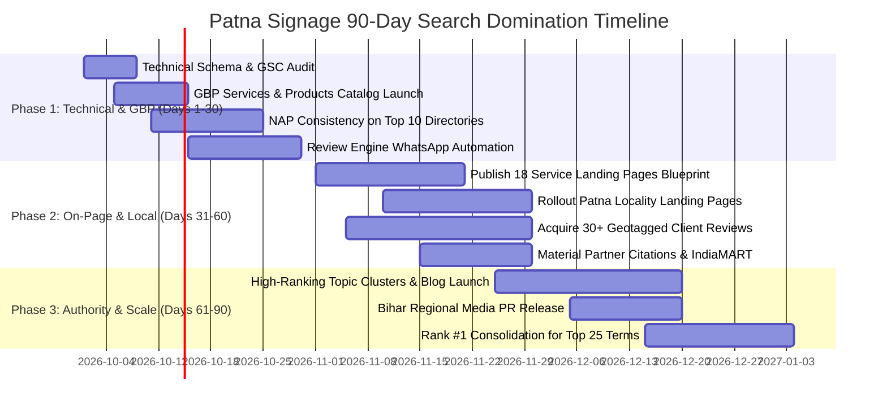

# PATNA SIGNAGE — GOOGLE SEARCH #1 RANKING MASTER PLAN & SEO BLUEPRINT
**The Definitive Operational Playbook for Google Organic Search & Google Maps (GBP 3-Pack) Domination in Patna, Bihar & Jharkhand**

---

## 🏛️ 1. Executive Summary & Master Ranking KPIs

This document establishes the strategic, technical, on-page, and local SEO blueprint to establish **Patna Signage** (`patnasignage.com`) as the **undisputed #1 ranking commercial signage manufacturer and commercial printing press** on Google Search and the **Google Maps Local 3-Pack** across Patna, all 38 districts of Bihar, and major industrial hubs in Jharkhand.

### Core Value Proposition & Competitive Moats:
- **34+ Years of Engineering Heritage (Est. 1990):** Over 3,500+ successfully completed commercial projects across Eastern India.
- **Factory-Direct Pricing (Zero Middleman):** Full in-house manufacturing equipped with CNC routers, fiber laser metal cutting, automated letter benders, 1440 DPI eco-solvent printers, Star Flex solvent presses, and sheetfed offset printing.
- **Prime Central Location:** Office & showroom located at Capital Tower, Fraser Road (CBD Patna) with rapid deployment across Boring Road, Bailey Road, Kankarbagh, and Danapur.
- **Enterprise Warranty & Quality Assurance:** 5-year comprehensive warranty on Samsung IP67 waterproof LED modules, 304 marine-grade stainless steel, and weather-retardant PVDF ACP panels.

### Strategic Ranking Benchmarks & Milestones:
| Ranking Milestone | Time Horizon | Target KPI / Metric | Success Indicator |
| :--- | :--- | :--- | :--- |
| **Google Maps Local 3-Pack** | 30 – 45 Days | Rank #1 – #3 for "sign board manufacturer in patna" & "led sign board patna" | 150+ direct phone calls & direction requests per month |
| **Core Signage Keywords** | 45 – 60 Days | Top 3 Organic placement for 25+ transactional commercial queries | First-page rankings across Patna, Gaya, Muzaffarpur |
| **Commercial Printing Keywords** | 45 – 75 Days | Top 5 Organic placement for offset, flex, banner, and vinyl searches | Inbound inquiries for high-volume catalogs, hoardings & corporate stationery |
| **Trophies & Lightboxes Keywords** | 60 – 90 Days | First-page domination for corporate mementos, crystal awards, and clip-on LED frames | B2B orders from banks, hospitals, universities & government bodies |
| **Organic Inbound Leads** | 90 Days | 200+ monthly qualified commercial leads | WhatsApp inquiries, quote forms & laser site survey bookings |

---

## 🔑 2. Master Keyword Matrix & Search Intent Architecture

Search queries are rigorously clustered by **Search Intent**, **Target URL**, **Commercial Value**, and **Geographic Scope**.

### Category A: Core Signage & Facade Fabrication (High Transaction Value)
| Keyword | Search Intent | Est. Monthly Volume (Bihar) | Target Landing Page | Priority Tier |
| :--- | :--- | :--- | :--- | :--- |
| `sign board manufacturer in patna` | Transactional / Commercial | 2,400+ | `/` (Home) | **Tier 1 (Highest)** |
| `sign board maker patna` | Transactional / Commercial | 1,900+ | `/` (Home) | **Tier 1** |
| `led sign board patna` | Transactional | 2,900+ | `/services/led-signage` | **Tier 1** |
| `3d acrylic letters patna` | Transactional | 1,600+ | `/services/3d-letters` | **Tier 1** |
| `acp sign board patna` | Transactional | 1,800+ | `/services/acp-signage` | **Tier 1** |
| `acp elevation work patna` | Commercial | 1,200+ | `/services/acp-signage` | **Tier 1** |
| `glow sign board manufacturer patna` | Transactional | 1,400+ | `/services/glow-sign-boards` | **Tier 1** |
| `shop front signage patna` | Transactional | 1,100+ | `/services/shop-front-signage` | **Tier 1** |
| `neon sign board patna` | Transactional | 1,500+ | `/services/neon-signs` | **Tier 1** |
| `custom neon signs patna` | Transactional | 1,200+ | `/services/neon-signs` | **Tier 1** |
| `stainless steel letters patna` | Transactional | 950+ | `/services/3d-letters` | **Tier 2** |
| `titanium gold letters patna` | Transactional | 750+ | `/services/3d-letters` | **Tier 2** |
| `corporate wayfinding signage patna` | Commercial | 600+ | `/services/corporate-signage` | **Tier 2** |
| `pylon sign board bihar` | Commercial | 500+ | `/signage` | **Tier 2** |
| `retail shopfront facade patna` | Commercial | 700+ | `/services/shop-front-signage` | **Tier 2** |

---

### Category B: Commercial & Industrial Printing Services (High Production Volume)
| Keyword | Search Intent | Est. Monthly Volume (Bihar) | Target Landing Page | Priority Tier |
| :--- | :--- | :--- | :--- | :--- |
| `flex printing in patna` | Transactional | 4,200+ | `/services/flex-banner-printing` | **Tier 1 (Highest)** |
| `banner printing patna` | Transactional | 3,600+ | `/services/flex-banner-printing` | **Tier 1** |
| `offset printing press patna` | Commercial / High-Volume | 2,800+ | `/services/offset-printing` | **Tier 1** |
| `vinyl printing in patna` | Transactional | 2,100+ | `/services/vinyl-printing` | **Tier 1** |
| `digital flex printing patna` | Transactional | 1,800+ | `/services/digital-flex-printing` | **Tier 1** |
| `star flex printing patna` | Transactional | 1,500+ | `/services/flex-banner-printing` | **Tier 1** |
| `brochure printing press patna` | Commercial | 1,300+ | `/services/offset-printing` | **Tier 2** |
| `catalog printing patna` | Commercial | 950+ | `/services/offset-printing` | **Tier 2** |
| `one way vision glass film patna` | Transactional | 1,100+ | `/services/vinyl-printing` | **Tier 2** |
| `3m frosted film glass patna` | Transactional | 1,250+ | `/services/vinyl-printing` | **Tier 2** |
| `eco solvent printing patna` | Commercial | 900+ | `/services/digital-flex-printing` | **Tier 2** |
| `packaging box printing patna` | Commercial | 850+ | `/services/offset-printing` | **Tier 2** |

---

### Category C: Corporate Trophies, Awards & Felicitation Plaques
| Keyword | Search Intent | Est. Monthly Volume (Bihar) | Target Landing Page | Priority Tier |
| :--- | :--- | :--- | :--- | :--- |
| `trophy shop in patna` | Transactional | 1,900+ | `/services/sports-trophies` | **Tier 1** |
| `corporate mementos patna` | Commercial | 1,400+ | `/services/corporate-mementos` | **Tier 1** |
| `crystal awards manufacturer patna` | Commercial | 1,100+ | `/services/crystal-awards` | **Tier 1** |
| `customized trophies patna` | Transactional | 1,300+ | `/services/customize-trophies` | **Tier 1** |
| `wooden mementos manufacturer patna` | Commercial | 900+ | `/services/corporate-mementos` | **Tier 2** |
| `sports championship cups patna` | Transactional | 850+ | `/services/sports-trophies` | **Tier 2** |
| `acrylic recognition shields patna` | Commercial | 700+ | `/services/customize-trophies` | **Tier 2** |
| `felicitation plaques bihar` | Commercial | 600+ | `/services/corporate-mementos` | **Tier 2** |

---

### Category D: Lightboxes, Clip-On Frames & Custom Wall Framing
| Keyword | Search Intent | Est. Monthly Volume (Bihar) | Target Landing Page | Priority Tier |
| :--- | :--- | :--- | :--- | :--- |
| `clip on led board patna` | Transactional | 1,200+ | `/services/clipon-boards` | **Tier 1** |
| `led snap frame lightbox patna` | Transactional | 950+ | `/services/clipon-boards` | **Tier 1** |
| `slim photo frames patna` | Transactional | 850+ | `/services/slim-photo-frames` | **Tier 1** |
| `photo frame maker in patna` | Transactional | 1,800+ | `/services/photo-frames` | **Tier 1** |
| `custom wall framing shop patna` | Transactional | 1,100+ | `/services/photo-frames` | **Tier 2** |
| `menu board lightbox for restaurant patna` | Commercial | 800+ | `/services/clipon-boards` | **Tier 2** |
| `backlit fabric seg lightbox patna` | Commercial | 650+ | `/signage` | **Tier 2** |

---

### Category E: Hyper-Local Patna Commercial Corridors
Google algorithms deliver localized results based on the searcher's physical GPS pin. Target these high-intent corridor terms:
1. **Fraser Road / Exhibition Road (800001):** `sign board shop fraser road patna`, `printing press near capital tower`, `signage manufacturer exhibition road patna`, `flex printing dak bunglow patna`.
2. **Boring Road / Boring Canal Road (800001):** `led board maker boring road patna`, `acrylic letter board boring road`, `flex printing boring canal road`, `neon sign shop boring road`.
3. **Bailey Road / Saguna More / Danapur (800014 / 801503):** `hospital sign board bailey road patna`, `shop sign board saguna more danapur`, `flex banner printing rukanpura patna`, `acp cladding bailey road`.
4. **Kankarbagh / Rajendra Nagar (800020 / 800016):** `glow sign board kankarbagh patna`, `banner printing shop tiwari bechar kankarbagh`, `clinic sign board kankarbagh`, `offset printing press rajendra nagar`.
5. **Patliputra Colony / Digha (800013):** `industrial signage patliputra patna`, `corporate building signage digha`, `commercial vinyl branding patliputra`.
6. **Transport Nagar / Zero Mile / Kumhrar (800007 / 800026):** `wholesale flex banner printing zero mile`, `industrial safety signage factory patna`, `highway hoarding fabrication transport nagar`.

---

### Category F: Regional Bihar & Jharkhand B2B Expansion Keywords
- **Tier-2 Bihar Industrial & Commercial Hubs:**
  - Gaya: `sign board manufacturer in gaya`, `led sign board gaya bihar`, `flex printing gaya`
  - Muzaffarpur: `sign board maker muzaffarpur`, `acp elevation sign board muzaffarpur`, `offset printing muzaffarpur`
  - Bhagalpur: `led sign board bhagalpur`, `glow sign board maker bhagalpur`, `flex banner printing bhagalpur`
  - Darbhanga: `sign board manufacturer darbhanga`, `printing press in darbhanga`
  - Begusarai: `commercial sign board begusarai`, `industrial safety signs begusarai`
  - Purnea: `flex printing purnea bihar`, `led sign board shop purnea`
- **Jharkhand Commercial Centers:**
  - Ranchi: `commercial sign board manufacturer ranchi`, `led 3d acrylic letters ranchi`
  - Jamshedpur: `retail signage fabrication jamshedpur`, `acp cladding tata nagar`
  - Dhanbad: `pylon sign board dhanbad`, `industrial sign board manufacturer dhanbad`
  - Bokaro: `commercial sign board maker bokaro steel city`

---

## 🏗️ 3. Complete On-Page SEO Blueprint & Metadata Architecture for ALL 18 Services + Core Pages

Every single page on `patnasignage.com` is engineered with unique, click-optimized metadata, a single `<h1>` tag, keyword-rich `<h2>` subheadings, technical specifications, and clear conversion calls-to-action.

---

### 1. Home Page (`/`)
- **Target URL:** `https://patnasignage.com/`
- **Primary Keywords:** `sign board manufacturer in patna`, `led sign board patna`, `flex printing patna`, `acp elevation`, `printing press patna`
- **Title Tag (67 chars):** `Patna Signage | #1 Sign Board Manufacturer & Printing Press in Patna`
- **Meta Description (158 chars):** `Factory-direct sign board manufacturer & printing press in Patna since 1990. LED 3D letters, ACP facades, flex banners, offset press. Free laser survey: 9308327111.`
- **H1:** `Direct Factory Sign Board Manufacturer & Printing Press in Patna, Bihar`
- **H2 Structure:**
  - `Why 3,500+ Businesses in Bihar & Jharkhand Choose Patna Signage`
  - `Our Core Capabilities: Signage Fabrication, Commercial Printing & Awards`
  - `Trusted by Enterprise Leaders: SBI, LIC, Apollo Clinics & Top Retailers`
  - `Our In-House Factory: CNC Routers, Fiber Laser & High-Speed Presses`
  - `Client Reviews & Completed Project Gallery Across Fraser Road & Boring Road`
  - `Frequently Asked Questions (FAQ) on Signage & Commercial Printing in Patna`
- **Word Count Target:** 1,800 – 2,200 words.
- **Conversion CTA:** *"Book Free Laser Site Survey"* & *"Call Direct Factory Hotline: +91 9308327111"*.

---

### 2. Commercial LED Signage (`/services/led-signage`)
- **Target URL:** `https://patnasignage.com/services/led-signage`
- **Primary Keywords:** `led sign board patna`, `led sign board manufacturer patna`, `3d backlit letters`, `waterproof led signboard bihar`
- **Title Tag (64 chars):** `LED Sign Board Manufacturer in Patna | Waterproof 3D Backlit Letters`
- **Meta Description (158 chars):** `Commercial LED sign boards in Patna built with Samsung IP67 waterproof LEDs, cast acrylic & 5-year warranty. Factory direct pricing. Free laser site survey across Bihar.`
- **H1:** `Commercial LED Sign Boards & 3D Backlit Letters in Patna`
- **H2 Structure:**
  - `Frontlit, Backlit & Halo-Lit 3D LED Letters Engineered for Patna Weather`
  - `Technical Specifications: Samsung IP67 Modules, Mean Well SMPS & Cast Acrylic`
  - `Energy Efficiency & 5-Year Comprehensive Warranty Breakdown`
  - `Ideal Applications: Retail Showrooms, Hospitals, Jewelry Stores & Banks`
  - `Real Project Showcase: Apex Hospital & Fraser Road Retail Outlets`
  - `LED Sign Board Pricing per Sq. Ft. & Fast Turnaround in Bihar`
- **Word Count Target:** 1,200 – 1,500 words.
- **Conversion CTA:** *"Get Custom LED Signboard Quotation on WhatsApp"*.

---

### 3. Architectural 3D Letters (Acrylic & SS 304) (`/services/3d-letters`)
- **Target URL:** `https://patnasignage.com/services/3d-letters`
- **Primary Keywords:** `3d letters patna`, `acrylic letters patna`, `stainless steel letters patna`, `titanium gold letters bihar`
- **Title Tag (65 chars):** `3D Letters Manufacturer in Patna | SS 304 Titanium Gold & Acrylic`
- **Meta Description (159 chars):** `Architectural 3D channel letters fabricated with SS 304 stainless steel, Titanium Gold & block acrylic. Automated laser micro-welding with warm halo glow in Patna.`
- **H1:** `Architectural 3D Channel Letters (SS 304 Stainless Steel & Acrylic) in Patna`
- **H2 Structure:**
  - `Precision Laser Micro-Welding with Zero Joint Lines`
  - `Substrate Choices: PVD Titanium Gold, Rose Gold, Mirror Chrome & Matte Black`
  - `Solid Cast Acrylic Block Lettering (10mm to 30mm Gauge)`
  - `Halo Backlighting with High-CRI 3000K Warm White & 6500K Cool White LEDs`
  - `Corporate Reception Wall & Building Crown Installations Across Patna`
  - `Price Per Inch Height Guide & Material Durability Specs`
- **Word Count Target:** 1,100 – 1,400 words.

---

### 4. ACP Signage & Facade Elevation Cladding (`/services/acp-signage`)
- **Target URL:** `https://patnasignage.com/services/acp-signage`
- **Primary Keywords:** `acp sign board patna`, `acp elevation patna`, `acp sheet shopfront cladding bihar`, `alstone acp dealer patna`
- **Title Tag (67 chars):** `ACP Sign Board & Facade Cladding in Patna | Alstone & Aludecor Panels`
- **Meta Description (157 chars):** `Heavy-duty ACP elevation cladding & sign boards in Patna. Fire-retardant 3mm/4mm panels with CNC grooved push-through letters and structural iron framing.`
- **H1:** `ACP Sign Boards & Commercial Facade Elevation Cladding in Patna`
- **H2 Structure:**
  - `Complete Architectural Shopfront Transformation with Alstone & Aludecor ACP`
  - `Structural Integrity: 1.5" & 2" Galvanized Steel Framing Built to Resist Bihar Storms`
  - `CNC Routing & Flush Push-Through Acrylic Letter Illumination`
  - `Fire-Retardant (FR Grade) & PVDF Weatherproof Coatings for 10+ Year Life`
  - `Commercial Elevations for Automobile Dealerships, Malls & Corporate HQs`
  - `Per Square Foot Rate Breakdown & Free On-Site Laser Measurement`
- **Word Count Target:** 1,200 – 1,500 words.

---

### 5. Backlit Glow Sign Boards (`/services/glow-sign-boards`)
- **Target URL:** `https://patnasignage.com/services/glow-sign-boards`
- **Primary Keywords:** `glow sign board manufacturer patna`, `backlit glow sign board`, `retail glow signboard bihar`, `star flex glow sign patna`
- **Title Tag (63 chars):** `Glow Sign Board Manufacturer in Patna | Heavy-Duty Backlit Flex`
- **Meta Description (158 chars):** `High-visibility commercial glow sign boards in Patna. 550 GSM Star Flex, energy-efficient LED tube battens & rustproof GI powder-coated boxes. 24/7 visibility.`
- **H1:** `Commercial Glow Sign Boards & Backlit Box Signage in Patna`
- **H2 Structure:**
  - `Cost-Effective 24/7 Nighttime High Visibility for Retail Shops & Pharmacies`
  - `Heavy-Gauge Galvanized Iron (GI) Framing with Powder-Coated Rustproof Finish`
  - `Even Internal Illumination with Commercial Philips/Havells LED Tube Arrays`
  - `Single-Sided Wall Mounted vs Double-Sided Projection Flange Glow Signs`
  - `Standard Retail Sizing & 48-Hour Rapid Fabrication Turnaround`
- **Word Count Target:** 1,000 – 1,300 words.

---

### 6. Shop Front Signage & Retail Facades (`/services/shop-front-signage`)
- **Target URL:** `https://patnasignage.com/services/shop-front-signage`
- **Primary Keywords:** `shop front signage patna`, `retail shop board design patna`, `storefront branding bihar`, `commercial fascia board patna`
- **Title Tag (65 chars):** `Shop Front Signage & Storefront Branding in Patna | Turnkey Facades`
- **Meta Description (159 chars):** `Complete retail shopfront signage & storefront facade design in Patna. 3D letters, ACP panelling, under-fascia lighting & licensed scaffolding installation.`
- **H1:** `Turnkey Shop Front Signage & Storefront Facade Branding in Patna`
- **H2 Structure:**
  - `Maximizing Walk-In Customer Footfall with High-Impact Exterior Fascias`
  - `End-to-End Architectural Execution: 3D CAD Mockup to Scaffolding Installation`
  - `Integrated Under-Fascia Ambient Lighting & Entrance Portal Branding`
  - `Retail Brand Guidelines Compliance for National Chains & Franchises in Patna`
  - `Case Studies: Fashion Boutiques, Electronics Outlets & Supermarkets on Boring Road`
- **Word Count Target:** 1,100 – 1,400 words.

---

### 7. Corporate Signage & Directional Wayfinding (`/services/corporate-signage`)
- **Target URL:** `https://patnasignage.com/services/corporate-signage`
- **Primary Keywords:** `corporate signage patna`, `wayfinding signs bihar`, `hospital directional signs patna`, `office reception signs patna`
- **Title Tag (66 chars):** `Corporate Signage & Wayfinding in Patna | Executive Office Branding`
- **Meta Description (158 chars):** `Architectural corporate signage & interior wayfinding in Patna. Frosted glass manifestation, brushed metal door signs, floor directories & suspended signage.`
- **H1:** `Corporate Signage, Executive Reception Branding & Wayfinding in Patna`
- **H2 Structure:**
  - `Creating an Authoritative Corporate Presence for HQs, Banks & Institutions`
  - `Interior Wayfinding Systems: Suspended Directional Signs, Totems & Floor Maps`
  - `Executive Reception Feature Walls: Floating Acrylic & Laser-Etched Brass Emblems`
  - `Hospital & Medical Center Signage Compliance (NABH Standard Guidelines)`
  - `Interchangeable Room Signage, Tactile Braille Signboards & Safety Markers`
- **Word Count Target:** 1,100 – 1,400 words.

---

### 8. Custom LED Neon Signs & Neon Art (`/services/neon-signs`)
- **Target URL:** `https://patnasignage.com/services/neon-signs`
- **Primary Keywords:** `neon sign board patna`, `custom neon signs patna`, `led neon flex bihar`, `neon lights for cafe patna`
- **Title Tag (62 chars):** `Custom LED Neon Signs in Patna | Neon Light Art for Cafes & Rooms`
- **Meta Description (156 chars):** `Custom handcrafted LED neon signs in Patna. Safe 12V silicone neon flex on 8mm optical acrylic with wireless dimmer & power adapter. 3-day express dispatch.`
- **H1:** `Handcrafted Custom LED Neon Signs & Neon Art in Patna`
- **H2 Structure:**
  - `Modern 12V Silicone LED Neon Flex vs Fragile Traditional Glass Neon`
  - `8mm CNC Contour-Cut Optical Acrylic Backplates (Clear, Black & Mirror Finish)`
  - `Wireless RF Remote Dimming, Color-Changing RGB & Dynamic Lighting Effects`
  - `Trending Applications: Instagrammable Photo Booths, Cafes, Bars & Weddings`
  - `Custom Text & Logo Neon Configurator with Express 3-Day Turnaround`
- **Word Count Target:** 1,000 – 1,300 words.

---

### 9. Commercial Offset Printing (`/services/offset-printing`)
- **Target URL:** `https://patnasignage.com/services/offset-printing`
- **Primary Keywords:** `offset printing press patna`, `commercial printing bihar`, `brochure printing patna`, `catalog printing press patna`
- **Title Tag (64 chars):** `Offset Printing Press in Patna | Catalogs, Brochures & Packaging`
- **Meta Description (160 chars):** `Leading commercial offset printing press in Patna. High-volume 4-color brochures, product catalogs, corporate stationery & luxury packaging. Same-day quotation.`
- **H1:** `High-Volume Commercial Offset Printing Press in Patna`
- **H2 Structure:**
  - `Industrial Sheetfed Multi-Color Offset Printing for Unmatched Per-Unit Economy`
  - `Direct Computer-to-Plate (CTP) Thermal Laser Prepress for Razor-Sharp Detail`
  - `Substrate Mastery: 70 GSM Maplitho to 450 GSM Imported Art Cards & Metpet`
  - `Post-Press Finishing: Thermal Matte/Gloss Lamination, Spot UV, Foiling & Creasing`
  - `Bulk Commercial Production: Product Catalogs, Annual Reports, Envelopes & Mono Cartons`
  - `Wholesale Pricing Tiers from 500 to 1,00,000+ Units with Same-Day Dispatch`
- **Word Count Target:** 1,400 – 1,800 words.

---

### 10. Flex & Banner Printing (`/services/flex-banner-printing`)
- **Target URL:** `https://patnasignage.com/services/flex-banner-printing`
- **Primary Keywords:** `flex printing in patna`, `banner printing patna`, `star flex printing bihar`, `hoarding printing patna`
- **Title Tag (65 chars):** `Flex & Banner Printing in Patna | Star Flex, Hoardings & Backdrops`
- **Meta Description (160 chars):** `Heavy-duty outdoor flex & banner printing in Patna. Star Flex (280-550 GSM), hoardings, election banners & event backdrops with rainproof inks. 24-hr express dispatch.`
- **H1:** `Heavy-Duty Outdoor Flex & Banner Printing in Patna`
- **H2 Structure:**
  - `High-Speed Roll-to-Roll Solvent Printing with Weather-Resistant Outdoor Pigments`
  - `Substrate Spectrum: Economy Frontlit (280 GSM) to Heavy Korean Star Flex (550 GSM)`
  - `Reinforced Finishing: High-Frequency Seam Welding, Brass Eyelets & Rod Pockets`
  - `Seamless Extra-Wide Printing Up to 10.5 Feet Roll Width Without Joint Seams`
  - `Rapid Emergency Turnaround: Same-Day Printing & Dispatch for Urgent Campaigns`
  - `On-Site Mounting, Truss Backdrops & Iron Framing Services Across Patna`
- **Word Count Target:** 1,300 – 1,600 words.

---

### 11. Digital Flex & Eco-Solvent Printing (`/services/digital-flex-printing`)
- **Target URL:** `https://patnasignage.com/services/digital-flex-printing`
- **Primary Keywords:** `digital flex printing patna`, `eco solvent printing patna`, `1440 dpi printing bihar`, `backlit fabric printing patna`
- **Title Tag (68 chars):** `Digital Flex Printing in Patna | 1440 DPI High-Definition Eco-Solvent`
- **Meta Description (158 chars):** `Ultra-sharp 1440 DPI digital flex & eco-solvent printing in Patna. Vibrant backlit fabric, canvas & showroom graphics with odourless inks. Factory direct rates.`
- **H1:** `High-Definition Digital Flex & Eco-Solvent Printing in Patna`
- **H2 Structure:**
  - `Micro-Piezo Printhead Technology Delivering 1440 DPI Photographic Realism`
  - `Zero Odour Green Eco-Solvent Inks Certified for Hospitals, Schools & Indoor Spaces`
  - `Premium Media: Backlit Polymeric Film, Matte Canvas, Satin Fabric & Clear Film`
  - `Backlit Lightbox Durability with Rich Color Saturation Under Daytime & Night Illumination`
  - `Luxury Showroom Graphics for Jewelry Outlets, Healthcare Clinics & Exhibition Booths`
- **Word Count Target:** 1,100 – 1,400 words.

---

### 12. Vinyl Printing & Custom Glass Manifestation (`/services/vinyl-printing`)
- **Target URL:** `https://patnasignage.com/services/vinyl-printing`
- **Primary Keywords:** `vinyl printing in patna`, `3m frosted film patna`, `one way vision printing patna`, `glass sticker cutting bihar`
- **Title Tag (61 chars):** `Vinyl Printing & Branding in Patna | 3M Frosted Film & Decals`
- **Meta Description (160 chars):** `Custom self-adhesive vinyl printing, 3M frosted glass film, one-way vision mesh & vehicle wraps in Patna. Matte/gloss lamination with precision plotter contour cut.`
- **H1:** `Custom Vinyl Printing, Glass Manifestation & Vehicle Branding in Patna`
- **H2 Structure:**
  - `High-Grade Self-Adhesive Cast & Calendered Vinyl with Protective Thermal Lamination`
  - `3M Architectural Frosted Glass Films with CNC Plotter Logo & Stripe Cutting`
  - `Perforated One-Way Vision Film for Showroom Facades & Commercial Vehicles`
  - `Commercial Fleet Graphics & Van Wraps Built for Extreme Sun & Weather Resistance`
  - `Clean Residue-Free Removal Protocols for Rented Corporate Spaces`
- **Word Count Target:** 1,200 – 1,500 words.

---

### 13. Corporate Mementos & Felicitation Plaques (`/services/corporate-mementos`)
- **Target URL:** `https://patnasignage.com/services/corporate-mementos`
- **Primary Keywords:** `corporate mementos patna`, `wooden mementos manufacturer patna`, `felicitation plaques bihar`, `appreciation awards patna`
- **Title Tag (67 chars):** `Corporate Mementos & Felicitation Plaques in Patna | Bespoke Awards`
- **Meta Description (159 chars):** `Handcrafted wooden mementos, brass felicitation plaques & appreciation awards in Patna. Fiber laser engraving, full-color UV printing & luxury velvet gift boxes.`
- **H1:** `Corporate Mementos, Felicitation Plaques & Institutional Shields in Patna`
- **H2 Structure:**
  - `Hand-Polished Teakwood, Mahogany & High-Density MDF Architectural Bases`
  - `Anodized Golden Brass Crests & Sublimation Metallic Inlays with Mirror Borders`
  - `Fiber Laser Deep Micro-Engraving & Vibrant High-Resolution UV Color Printing`
  - `Institutional Honors for Government Convocations, Bank Retirements & Conferences`
  - `Custom Logo Embossing & Presentation Velvet-Lined Keepsake Gift Boxes`
- **Word Count Target:** 1,000 – 1,300 words.

---

### 14. Sports Trophies & Championship Cups (`/services/sports-trophies`)
- **Target URL:** `https://patnasignage.com/services/sports-trophies`
- **Primary Keywords:** `sports trophies patna`, `championship cup trophy bihar`, `cricket tournament trophies patna`, `trophy wholesale market patna`
- **Title Tag (65 chars):** `Sports Trophies & Championship Cups in Patna | Tournament Awards`
- **Meta Description (158 chars):** `Premium sports trophies, metallic championship cups & tournament medals in Patna. Multi-tier column designs, heavy marble bases & personalized engraved crests.`
- **H1:** `Championship Sports Trophies, Tournament Cups & Medals in Patna`
- **H2 Structure:**
  - `High-Luster Electroplated Gold, Silver & Bronze Metallic Tournament Cups`
  - `Heavy Weighted Natural Italian Marble & Cast Resin Sturdy Display Bases`
  - `Multi-Tier Column Trophies for Cricket, Football, Badminton & School Sports Days`
  - `Custom Laser-Etched Title Plates with Organization Logo, Category & Year`
  - `Bulk Wholesale Trophies with Express 48-Hour Assembly for Large Sports Meets`
- **Word Count Target:** 950 – 1,200 words.

---

### 15. Customize Trophies & Bespoke Awards (`/services/customize-trophies`)
- **Target URL:** `https://patnasignage.com/services/customize-trophies`
- **Primary Keywords:** `customize trophies patna`, `bespoke awards maker bihar`, `custom acrylic trophies patna`, `3d laser cut award designs`
- **Title Tag (66 chars):** `Custom Trophies & Bespoke Awards in Patna | 3D Laser-Cut Designs`
- **Meta Description (159 chars):** `100% custom-designed trophies & bespoke awards in Patna. Multi-layer acrylic, metal casting & wood combinations. Free 3D CAD design mockup before production.`
- **H1:** `Custom Designed Trophies & Bespoke Recognition Awards in Patna`
- **H2 Structure:**
  - `100% Bespoke Structural Design Formed Around Your Brand Logo & Theme`
  - `Multi-Material Fusion: Laser-Cut Cast Acrylic, Polished Brass & Hardwood`
  - `Complimentary 3D CAD Visual Mockup Renderings Prior to Bulk Production`
  - `Corporate Excellence Awards, Sales Achiever Trophies & Annual Gala Statuettes`
  - `Tiered Quantity Price Discounts & Safe Multi-City Shipping Across Eastern India`
- **Word Count Target:** 1,000 – 1,300 words.

---

### 16. Crystal Awards & 3D Laser Etched Trophies (`/services/crystal-awards`)
- **Target URL:** `https://patnasignage.com/services/crystal-awards`
- **Primary Keywords:** `crystal awards patna`, `3d laser etched crystal trophy`, `optical crystal plaque bihar`, `executive glass awards patna`
- **Title Tag (67 chars):** `Crystal Awards & 3D Laser Trophies in Patna | Premium K9 Glass Plaques`
- **Meta Description (159 chars):** `Flawless K9 optical crystal awards & 3D subsurface laser-etched trophies in Patna. Diamond-beveled edges, high light refraction & satin-lined presentation boxes.`
- **H1:** `Premium Optical K9 Crystal Awards & 3D Subsurface Laser Trophies in Patna`
- **H2 Structure:**
  - `Ultra-Pure K9 Optical Crystal with Flawless Light Refraction & Zero Bubbles`
  - `Subsurface Green Laser Etching (SSLE) Embedding 3D Logos & Buildings Inside Crystal`
  - `Precision Diamond-Beveled Facets & Monolithic Crystal Tower Geometries`
  - `Distinguished Honors for Boardrooms, Lifetime Achievement & Medical Fellowships`
  - `Satin-Lined Hardcover Presentation Gift Boxes Included with Every Piece`
- **Word Count Target:** 1,000 – 1,300 words.

---

### 17. LED Clip-On Boards & Snap Frames (`/services/clipon-boards`)
- **Target URL:** `https://patnasignage.com/services/clipon-boards`
- **Primary Keywords:** `clip on led board patna`, `led snap frame lightbox bihar`, `restaurant menu board patna`, `slim clipon display frame`
- **Title Tag (64 chars):** `LED Clip-On Boards & Snap Frames in Patna | Ultra-Slim Lightboxes`
- **Meta Description (160 chars):** `15mm ultra-slim LED clip-on snap frame lightboxes in Patna. Laser-etched acrylic LGP for uniform backlighting. Quick graphic change for restaurant menu boards.`
- **H1:** `Ultra-Slim LED Clip-On Boards & Snap Frame Lightboxes in Patna`
- **H2 Structure:**
  - `15mm Ultra-Thin Architectural Anodized Aluminum Snap-Action Extrusions`
  - `Laser-Dot Etched Light Guide Plate (LGP) Guaranteeing 100% Hotspot-Free Brightness`
  - `Tool-Free Front-Opening Snap Profiles for 30-Second Graphic Replacement`
  - `High-Transmission Backlit Film Printing Producing Brilliant Photo Vibrancy`
  - `Ideal Applications: Fast Food QSR Menus, Cinema Posters & Mall High-Street Displays`
- **Word Count Target:** 950 – 1,250 words.

---

### 18. Slim LED Photo Frames & Lightboxes (`/services/slim-photo-frames`)
- **Target URL:** `https://patnasignage.com/services/slim-photo-frames`
- **Primary Keywords:** `slim led photo frames patna`, `frameless magnetic lightbox`, `acrylic led photo frame bihar`, `ambient wall light frame`
- **Title Tag (66 chars):** `Slim LED Photo Frames & Lightboxes in Patna | Magnetic Frameless Glow`
- **Meta Description (159 chars):** `12mm ultra-slim magnetic LED photo frames in Patna. Frameless diamond-polished acrylic faceplate with soft ambient wall halo glow. Ideal for corporate lobbies.`
- **H1:** `Slim LED Acrylic Photo Frames & Frameless Magnetic Lightboxes in Patna`
- **H2 Structure:**
  - `Ultra-Slim 12mm Low-Profile Profile with Invisible Magnetic Faceplate Locking`
  - `Diamond Edge-Polished Optical Cast Acrylic Front with Ambient Peripheral Glow`
  - `Soft 4000K Natural White & 6500K Daylight LED Edge-Lighting Modules`
  - `Luxury Decorative Accent for Hotel Suites, Executive Cabins & Memorial Displays`
  - `Energy-Efficient 12V Low Voltage Operation with Concealed Cord Management`
- **Word Count Target:** 950 – 1,200 words.

---

### 19. Custom Photo Frames & Wall Framing (`/services/photo-frames`)
- **Target URL:** `https://patnasignage.com/services/photo-frames`
- **Primary Keywords:** `photo frame maker in patna`, `custom picture framing patna`, `wooden photo frames shop bihar`, `gallery wall framing patna`
- **Title Tag (63 chars):** `Custom Photo Frames & Wall Framing in Patna | Handcrafted Mouldings`
- **Meta Description (158 chars):** `Handcrafted custom picture frames & gallery wall framing in Patna. Solid wood & synthetic mouldings, acid-free bevel mats & archival glass. Custom sizing.`
- **H1:** `Handcrafted Custom Photo Frames & Professional Wall Framing in Patna`
- **H2 Structure:**
  - `200+ Premium Moulding Profiles: Natural Seasoned Teak, Walnut, Gold & Minimal Black`
  - `Acid-Free Conservation Bevel-Cut Matboards to Prevent Print Discoloration`
  - `Glazing Options: Anti-Reflective Museum Float Glass & Shatter-Resistant Acrylic`
  - `Bespoke Gallery Wall Design & Coordinated Framing for Offices, Clinics & Homes`
  - `Large-Format Canvas Stretching & Heavy Mirror Wooden Framing Across Patna`
- **Word Count Target:** 1,000 – 1,300 words.

---

### 20. Frameless Backlit Fabric Lightbox (SEG) (`/services/backlit-fabric`)
- **Target URL:** `https://patnasignage.com/services/backlit-fabric`
- **Primary Keywords:** `backlit fabric seg lightbox patna`, `frameless textile lightbox bihar`, `dye sublimation fabric printing patna`, `tension fabric light box`
- **Title Tag (67 chars):** `Frameless SEG Backlit Fabric Lightbox in Patna | Textile LED Signs`
- **Meta Description (158 chars):** `Frameless SEG backlit textile lightboxes in Patna. Dye-sublimation tension fabric graphics & edge-lit LED matrix. Tool-free 60-sec graphic swap for showrooms.`
- **H1:** `Frameless SEG Tension Fabric Lightboxes & Textile LED Displays in Patna`
- **H2 Structure:**
  - `Architectural Frameless Aluminium Profiles with Invisible Silicone Edge Beading (SEG)`
  - `High-Density 1440 DPI Dye-Sublimation Fabric Printing with Rich Glare-Free Saturation`
  - `Tool-Free 60-Second Fabric Graphic Replacement Without Wrinkles or Creases`
  - `Uniform Hotspot-Free Edge-Lit & Backlit LED Matrix with 50,000+ Burning Hours`
  - `Ideal for Fashion Flagships, Jewellery Showrooms & Automobile Dealerships in Bihar`
- **Word Count Target:** 950 – 1,250 words.

---

### 21. Roll-Up Standees, Gazebos & Promo Displays (`/services/roll-up-standees`)
- **Target URL:** `https://patnasignage.com/services/roll-up-standees`
- **Primary Keywords:** `roll up standee printing patna`, `promotional gazebo tent bihar`, `canopy tent manufacturer patna`, `demo table sampling counter`
- **Title Tag (66 chars):** `Roll-Up Standees & Promo Gazebos in Patna | Event Display Banners`
- **Meta Description (159 chars):** `Roll-up standees, luxury chrome banner stands, promotional folding gazebos & canopy tents in Patna. 1440 DPI non-tear blackout prints. Same-day emergency dispatch.`
- **H1:** `Portable Roll-Up Standees, Event Gazebos & Promotional Displays in Patna`
- **H2 Structure:**
  - `Standard & Luxury Chrome Base Retractable Roll-Up Banner Standees (2x5 to 5x8 ft)`
  - `Heavy-Duty Scissors-Frame Folding Promotional Gazebos & Waterproof 600D Canopies`
  - `Non-Tearable Poly Media & Eco-Solvent Printing with Zero Light Bleed-Through`
  - `Knockdown Promoter Demo Tables & Sampling Counters with Padded Canvas Carry Bags`
  - `Statewide Field Activation & Rural Roadshow Deployment Across Bihar & Jharkhand`
- **Word Count Target:** 1,000 – 1,300 words.

---

### 22. Highway Pylon & Monolith Totem Signs (`/services/pylon-totem`)
- **Target URL:** `https://patnasignage.com/services/pylon-totem`
- **Primary Keywords:** `pylon sign board patna`, `highway monolith sign bihar`, `petrol pump pylon manufacturer patna`, `freestanding totem signs`
- **Title Tag (65 chars):** `Highway Pylon & Monolith Totem Signs in Patna | Structural Towers`
- **Meta Description (159 chars):** `Structural freestanding highway pylon towers & monolith totem signs in Patna. Heavy steel truss, RCC foundation & Samsung LEDs tested for 140 km/h wind loads.`
- **H1:** `Structural Highway Pylon Towers & Freestanding Monolith Totem Signs in Patna`
- **H2 Structure:**
  - `Engineered Freestanding Pylon Towers Resisting Up to 140 km/h Monsoon Wind Gusts`
  - `Heavy IS 2062 Structural Steel Internal Skeletal Trusses & Reinforced RCC Footings`
  - `4mm Fire-Retardant PVDF ACP Cladding (Alstone/Aludecor) with 10+ Years Finish Life`
  - `Double-Sided IP68 Samsung LED Illumination with Optional Digital Pricing Panels`
  - `Turnkey Civil Excavation, Scaffolding & Crane-Assisted Highway Erection Across Bihar`
- **Word Count Target:** 1,100 – 1,400 words.

---

### 23. Industrial Safety Signs & Retroreflective Boards (`/services/safety-signs`)
- **Target URL:** `https://patnasignage.com/services/safety-signs`
- **Primary Keywords:** `industrial safety signs patna`, `3m retroreflective sign board bihar`, `fire exit glow in dark sign`, `factory hazard signboards`
- **Title Tag (66 chars):** `Industrial Safety Signs & 3M Reflective Boards in Patna | ISO 7010`
- **Meta Description (159 chars):** `Industrial safety signs & 3M retroreflective boards in Patna. Photoluminescent glow-in-dark fire exit signs & chemical hazard boards compliant with NBC & ISO 7010.`
- **H1:** `Industrial Safety Signage & 3M Retroreflective Emergency Boards in Patna`
- **H2 Structure:**
  - `Genuine 3M Engineer Grade & High-Intensity Prismatic Retroreflective Vinyl Sheeting`
  - `Photoluminescent Class C Glow-in-the-Dark Films Providing 4+ Hours Emergency Visibility`
  - `Corrosion-Resistant Fire-Retardant 3mm ACP & Heavy 20-Gauge Galvanized Iron Substrates`
  - `Strict Compliance with NBC 2016, Directorate of Factory Safety & ISO 7010 Norms`
  - `Trusted by L&T, Indian Oil, Indian Railways & State Manufacturing Facilities`
- **Word Count Target:** 1,000 – 1,300 words.

---

### 24. Double-Sided Moulded Flanges & Projection Signs (`/services/moulded-flanges`)
- **Target URL:** `https://patnasignage.com/services/moulded-flanges`
- **Primary Keywords:** `moulded flange sign board patna`, `double sided projecting sign bihar`, `lollipop sign board patna`, `pharmacy green cross flange`
- **Title Tag (66 chars):** `Double-Sided Moulded Flanges & Projecting Blade Signs in Patna`
- **Meta Description (159 chars):** `Double-sided vacuum-formed moulded acrylic flange blade signs in Patna. Embossed 3D logos, heavy GI brackets & internal Samsung LEDs for street traffic visibility.`
- **H1:** `Double-Sided Vacuum Moulded Flanges & Projecting Blade Signs in Patna`
- **H2 Structure:**
  - `Perpendicular Double-Sided Street Visibility Capturing Two-Way Foot & Road Traffic`
  - `Vacuum Thermoformed Optical Acrylic Faces with Distinct Embossed 3D Logo Contours`
  - `Heavy-Gauge Galvanized Iron Wall Bracket with Rust-Proof Electrostatic Powder Coat`
  - `High-Lumen IP67 Samsung LED Modules Distributing 360-Degree Hotspot-Free Glow`
  - `Ideal for Pharmacies, Retail Cafes, QSRs & Boutiques on Fraser Rd & Boring Rd`
- **Word Count Target:** 950 – 1,250 words.

---

### 25. Direct UV Flatbed Printing (`/services/uv-flatbed-printing`)
- **Target URL:** `https://patnasignage.com/services/uv-flatbed-printing`
- **Primary Keywords:** `uv flatbed printing patna`, `sunboard direct printing bihar`, `acrylic uv printing patna`, `flatbed glass printing bihar`
- **Title Tag (65 chars):** `Direct UV Flatbed Printing in Patna | Sunboard, Acrylic & Glass`
- **Meta Description (158 chars):** `Direct-to-substrate digital UV flatbed printing in Patna. Sunboard, acrylic, glass & wood up to 100mm. Instant LED cure, opaque white ink & 3D tactile varnish.`
- **H1:** `Direct UV Flatbed Printing on Rigid Sunboard, Acrylic & Glass in Patna`
- **H2 Structure:**
  - `Direct Printing on Rigid Substrates up to 100mm Thick: Sunboard, Acrylic, Glass & MDF`
  - `Instant Ultraviolet LED Curing Eliminating Vinyl Peeling, Bubbling & Delamination`
  - `Opaque White Ink Layering for Striking Contrast on Transparent Acrylic & Dark Metals`
  - `Tactile 3D Embossed Clear Varnish Effects for Ultra-Luxury Corporate Visuals`
  - `Cost-Effective In-Store Retail POS Standees, Header Cards & Architectural Wall Decor`
- **Word Count Target:** 1,000 – 1,300 words.

---

### 26. Commercial Packaging Boxes & Mono Cartons (`/services/packaging-boxes`)
- **Target URL:** `https://patnasignage.com/services/packaging-boxes`
- **Primary Keywords:** `packaging box printing patna`, `mono carton manufacturer bihar`, `custom printed rigid boxes patna`, `corrugated mailer printing`
- **Title Tag (66 chars):** `Commercial Packaging Boxes & Mono Cartons in Patna | Offset Press`
- **Meta Description (159 chars):** `Custom printed product packaging boxes, mono cartons & luxury rigid boxes in Patna. 250–450 GSM SBS board with gold foiling, spot UV & precision die-cutting.`
- **H1:** `Custom Commercial Packaging Boxes & High-Speed Mono Cartons in Patna`
- **H2 Structure:**
  - `Custom Structural Box CAD Dieline Engineering Tailored to Your Specific Product`
  - `High-Speed 4 & 5-Color Sheetfed Offset Printing on 250 to 450 GSM Virgin SBS Board`
  - `Luxury Finishing: Metallic Gold Foiling, Thermal Matte Lamination & Drip-Off UV`
  - `High-Speed Automatic Die-Cutting, Embossing & Robotic Carton Folding-Gluing Lines`
  - `Certified B2B Production for Pharmaceuticals, Cosmetics, Sweets & E-Commerce Mailers`
- **Word Count Target:** 1,050 – 1,350 words.

---

## 🗺️ 4. Google Business Profile (GBP) & Local 3-Pack Supremacy Framework

Securing the **Top 3 Local Pack positions on Google Maps** drives over 65% of inbound calls and WhatsApp inquiries. Follow this strict execution protocol.

### A. 100% NAP Consistency Protocol
The Master NAP must be indexed identically across every web asset:
- **Business Name:** `PATNA SIGNAGE`
- **Registered Address:** `Near Canara Bank, B1, Capital Tower, Fraser Rd, Patna, Bihar - 800001`
- **Primary Hotline:** `+91 9308327111`
- **Secondary Hotline:** `+91 7070170040`
- **WhatsApp Support:** `+91 99052 79579`
- **Official Website:** `https://patnasignage.com`
- **Exact Coordinates:** `25.6073388, 85.1362679`

### B. Category Mapping Configuration
- **Primary Category:** `Sign shop`
- **Secondary Categories:**
  1. `Commercial printer`
  2. `Print shop`
  3. `Digital printing service`
  4. `Banner store`
  5. `Manufacturer`
  6. `Corporate gift supplier`

### C. Service Area Radius Setup
In Google Business Profile under **Edit Profile > Service Areas**, add:
- **Patna Core Localities:** Fraser Road (800001), Boring Road (800001), Bailey Road (800014), Kankarbagh (800020), Danapur / Saguna More (801503), Patliputra Colony (800013), Exhibition Road (800001), Transport Nagar (800007), Rajendra Nagar (800016), Anisabad (800002), Phulwari Sharif (801505).
- **All 38 Bihar Districts:** Gaya, Muzaffarpur, Bhagalpur, Darbhanga, Begusarai, Purnea, Munger, Arrah, Chapra, Motihari, Samastipur, Nalanda / Bihar Sharif, Saharsa, Sasaram, Bettiah, Katihar.
- **Jharkhand Commercial Centers:** Ranchi, Jamshedpur, Dhanbad, Bokaro Steel City, Deoghar, Hazaribagh.

### D. Geotagged Photo Upload Protocol (Weekly Routine)
Google Maps uses EXIF metadata (GPS latitude & longitude) embedded inside uploaded images to establish local geographical relevance.
1. **EXIF Injection:** Every photograph of a completed signboard, offset press, or trophy installation MUST be tagged with coordinates `25.6073388, 85.1362679` or the customer's actual locality coordinates before uploading.
2. **Descriptive Image File Naming:** Never upload generic file names (e.g. `IMG_2026.jpg`). Rename files according to target keyword + locality:
   - `led-3d-sign-board-fraser-road-patna-sbi.jpg`
   - `acp-elevation-cladding-boring-road-patna.jpg`
   - `commercial-offset-printing-press-patna-factory.jpg`
   - `star-flex-banner-printing-bailey-road.jpg`
3. **Upload Cadence:** Upload a minimum of **3 new photos per week** directly into GBP Photos (Exterior, Interior, At Work, Team).

### E. The Automated 5-Star Review Generation Engine
Reviews containing specific keywords (e.g., *"best sign board manufacturer on Fraser Road"*) and customer installation photos carry 3x more ranking weight than plain text reviews.

#### Review Request Template 1: For Retail & Showroom Clients (English)
```text
Namaste [Client Name] ji, 🙏

Thank you for choosing Patna Signage for your new brand storefront at [Shop Name, Location]! Our fabrication team was thrilled to work on your project.

Could you take 30 seconds to support our local Fraser Road workshop with a 5-star Google review? 

👉 [Insert Direct Google Review Shortlink]

💡 Pro-Tip: If you can mention the service (e.g. "Loved the 3D LED acrylic letters" or "Best signboard maker in Patna") and attach a photo of your new glowing sign, it helps our craftsmen tremendously!

Warm regards,
Team Patna Signage | Capital Tower, Fraser Road
```

#### Review Request Template 2: For Local Bihar Business Owners (Hinglish)
```text
नमस्ते [Client Name] जी, 🙏

[Shop/Company Name] ke naye sign board / printing ke liye Patna Signage ko chunne ke liye bahut-bahut dhanyawad! 

Kya aap hamari Patna factory team ko support karne ke liye Google par 30 seconds dekar ek 5-star review de sakte hain?

👉 [Insert Direct Google Review Shortlink]

💡 Agar aap review me apne naye board ki photo aur "Best LED sign board in Patna" ya "Fast flex printing" likhenge toh ye hamare local karigaron ke liye bahut bada support hoga!

Dhanyawad,
Patna Signage | Fraser Road, Patna
```

#### Review Request Template 3: For Corporate, Bank & Hospital Clients (Formal)
```text
Dear [Client Name],

Thank you for partnering with Patna Signage for the corporate signage and branding installation at [Institution / Branch Name]. We trust the execution meets your architectural standards.

We would be deeply grateful if you could share a brief review of our fabrication quality, turnaround time, and safety compliance on Google:

👉 [Insert Direct Google Review Shortlink]

Thank you for your continued trust in our 34-year heritage.

Sincerely,
Operations Directorate | Patna Signage
```

### F. Google Q&A Pre-Seeding Strategy
Under your GBP listing, ask and answer these top customer questions using primary keywords:
1. **Q:** *Does Patna Signage manufacture sign boards directly in Patna or outsource?*
   - **A:** We are a direct factory manufacturer established in 1990 with our own CNC routers, fiber laser metal cutters, and automated letter benders right here in Patna. Clients are welcome to visit our workshop at B1, Capital Tower, Fraser Road.
2. **Q:** *Do you provide a warranty on LED 3D letters and sign boards?*
   - **A:** Yes, all our illuminated sign boards use genuine IP67 waterproof Samsung LED modules backed by a 5-year comprehensive replacement warranty.
3. **Q:** *Do you provide on-site laser measurements in Patna?*
   - **A:** Yes, we provide free on-site laser measurement and structural site surveys anywhere in Patna (Fraser Road, Boring Road, Bailey Road, Kankarbagh, Danapur) within 24 hours. Call +91 9308327111.
4. **Q:** *Do you supply signboards and flex printing outside Patna in Bihar and Jharkhand?*
   - **A:** Absolutely. We supply and install turnkey signboards, ACP cladding, and bulk printing across all 38 districts of Bihar (Gaya, Muzaffarpur, Bhagalpur, Darbhanga) and major Jharkhand commercial centers (Ranchi, Jamshedpur, Dhanbad).

---

## ⚙️ 5. Technical SEO, Schema.org Hierarchy & Core Web Vitals

A flawless technical foundation ensures Googlebot indexes all 18 service landing pages without crawl budget waste.

### A. Production-Ready JSON-LD LocalBusiness Schema
Add this comprehensive schema block directly to `index.html` to trigger Google Rich Results and Local Knowledge Graph recognition:

```html
<script type="application/ld+json">
{
  "@context": "https://schema.org",
  "@type": "LocalBusiness",
  "@id": "https://patnasignage.com/#organization",
  "name": "PATNA SIGNAGE",
  "alternateName": ["Patna Sign Board Manufacturer", "Patna Signage Printing Press"],
  "url": "https://patnasignage.com",
  "logo": "https://patnasignage.com/assets/patna-signage-logo-light.svg",
  "image": "https://patnasignage.com/assets/Hero%20background%20image.png",
  "description": "Bihar & Jharkhand's #1 direct factory sign board manufacturer and commercial printing press located at Fraser Road, Patna (Est. 1990). Specializing in 3D LED letters, ACP cladding, flex banner printing, offset press, and corporate awards.",
  "telephone": "+919308327111",
  "email": "patnasignage786@gmail.com",
  "priceRange": "₹₹",
  "foundingDate": "1990",
  "hasMap": "https://www.google.com/maps/place/PATNA+SIGNAGE/@25.6073388,85.1362679,17z",
  "sameAs": [
    "https://www.google.com/maps/place/PATNA+SIGNAGE/@25.6073388,85.1362679,17z"
  ],
  "address": {
    "@type": "PostalAddress",
    "streetAddress": "Near Canara Bank, B1, Capital Tower, Fraser Rd",
    "addressLocality": "Patna",
    "addressRegion": "Bihar",
    "postalCode": "800001",
    "addressCountry": "IN"
  },
  "geo": {
    "@type": "GeoCoordinates",
    "latitude": 25.6073388,
    "longitude": 85.1362679
  },
  "openingHoursSpecification": [
    {
      "@type": "OpeningHoursSpecification",
      "dayOfWeek": ["Monday", "Tuesday", "Wednesday", "Thursday", "Friday", "Saturday"],
      "opens": "09:00",
      "closes": "20:30"
    }
  ],
  "areaServed": [
    { "@type": "City", "name": "Patna" },
    { "@type": "State", "name": "Bihar" },
    { "@type": "State", "name": "Jharkhand" }
  ],
  "hasOfferCatalog": {
    "@type": "OfferCatalog",
    "name": "Signage Fabrication & Printing Catalog",
    "itemListElement": [
      {
        "@type": "Offer",
        "itemOffered": {
          "@type": "Service",
          "name": "Commercial LED Signage",
          "url": "https://patnasignage.com/services/led-signage"
        }
      },
      {
        "@type": "Offer",
        "itemOffered": {
          "@type": "Service",
          "name": "Architectural 3D Letters (Acrylic & SS)",
          "url": "https://patnasignage.com/services/3d-letters"
        }
      },
      {
        "@type": "Offer",
        "itemOffered": {
          "@type": "Service",
          "name": "ACP Signage & Cladding",
          "url": "https://patnasignage.com/services/acp-signage"
        }
      },
      {
        "@type": "Offer",
        "itemOffered": {
          "@type": "Service",
          "name": "Commercial Offset Printing",
          "url": "https://patnasignage.com/services/offset-printing"
        }
      },
      {
        "@type": "Offer",
        "itemOffered": {
          "@type": "Service",
          "name": "Outdoor Flex & Banner Printing",
          "url": "https://patnasignage.com/services/flex-banner-printing"
        }
      },
      {
        "@type": "Offer",
        "itemOffered": {
          "@type": "Service",
          "name": "Corporate Mementos & Awards",
          "url": "https://patnasignage.com/services/corporate-mementos"
        }
      }
    ]
  }
}
</script>
```

### B. Universal BreadcrumbList Schema Template
Implement on every service page (`/services/:slug`):
```json
{
  "@context": "https://schema.org",
  "@type": "BreadcrumbList",
  "itemListElement": [
    {
      "@type": "ListItem",
      "position": 1,
      "name": "Home",
      "item": "https://patnasignage.com"
    },
    {
      "@type": "ListItem",
      "position": 2,
      "name": "Services",
      "item": "https://patnasignage.com/services"
    },
    {
      "@type": "ListItem",
      "position": 3,
      "name": "LED Signage",
      "item": "https://patnasignage.com/services/led-signage"
    }
  ]
}
```

### C. Core Web Vitals Benchmark Targets
- **Largest Contentful Paint (LCP):** < 1.8 seconds (Achieved through lightweight Vite code-splitting and WebP asset delivery).
- **Cumulative Layout Shift (CLS):** < 0.05 (Achieved by fixing explicit height and aspect-ratio attributes on hero banners, logos, and service cards).
- **Interaction to Next Paint (INP):** < 100 milliseconds (Achieved via lightweight Vanilla CSS and React modular components).

---

## 📍 6. Programmatic Hyper-Local & Regional Expansion Landing Pages

To capture commercial queries from distinct commercial belts in Patna without keyword cannibalization, implement dedicated locality pages:

```
https://patnasignage.com/locations/
├── /boring-road/       -> "Sign Board Manufacturer & Flex Printing in Boring Road, Patna"
├── /fraser-road/       -> "Sign Board Shop Near Capital Tower & Fraser Road, Patna"
├── /bailey-road/       -> "LED Sign Boards & Commercial Printing on Bailey Road, Patna"
├── /kankarbagh/        -> "Glow Sign Boards & Banner Printing in Kankarbagh, Patna"
├── /danapur/           -> "Shop Front Facade & Signage Maker in Danapur & Saguna More"
├── /patliputra/        -> "Corporate Signage & Vinyl Branding in Patliputra Colony"
├── /transport-nagar/   -> "Industrial Safety Signage & Wholesale Flex Printing Zero Mile"
└── /exhibition-road/   -> "3D Letters & Offset Printing Press Exhibition Road Patna"
```

### Locality Landing Page Content Blueprint (600 – 800 Words Per Page):
1. **Hero Section:** `<h1>` targeting `[Service] in [Locality], Patna`.
2. **Local Landmark Citations:** Explicit references to local roads, commercial complexes (e.g. *"Serving retail shops along Boring Canal Road, Crossing, and Alankar Jewellers vicinity"*).
3. **Turnaround & Free Delivery:** Highlighting same-day delivery or 24-hr survey in that specific postal circle.
4. **Geo-Specific FAQ Accordion:** Answering questions specific to that locality's commercial norms.
5. **Local Case Study Proof:** Photos of installed signboards in that exact neighborhood.

---

## 📚 7. High-Ranking Content Marketing & Topic Clusters

Informational queries build top-of-funnel organic traffic, earn natural backlinks, and position Patna Signage as the authoritative technical consultant in Bihar.

### Top 10 High-Intent Topic Blueprints:

1. **The 2026 Commercial Sign Board Cost Guide in Patna (Per Sq. Ft. Pricing Explained)**
   - *Target Query:* `sign board price per sq ft patna`, `led board cost in patna`
   - *Intent:* High commercial research before purchase.
   - *Core Content:* Detailed breakdown comparing Normal Flex (₹12/sq.ft.), Glow Sign (₹120/sq.ft.), ACP 3D LED Letters (₹350–₹750/sq.ft.), and SS Titanium (₹85–₹350/inch).
   - *Conversion Hook:* Interactive price calculator + WhatsApp quote CTA.

2. **ACP Sign Board vs LED Acrylic Letters: Which is Better for Your Storefront?**
   - *Target Query:* `acp board vs acrylic letters`, `best signage for retail shop`
   - *Intent:* Evaluation stage.
   - *Core Content:* Durability comparison against Bihar sun, monsoon rain, night illumination contrast, and 5-year maintenance cost.

3. **Patna Municipal Corporation (PMC) Signboard Tax & Guidelines (2026 Updated)**
   - *Target Query:* `patna nagar nigam sign board tax`, `pmc outdoor advertisement rules`
   - *Intent:* High B2B compliance research.
   - *Core Content:* Permissible board sizes on commercial buildings, PMC registration guidelines, and how Patna Signage engineers structural framing to meet city norms.

4. **Why Samsung IP67 Waterproof LEDs Are Essential for Sign Boards in Bihar**
   - *Target Query:* `waterproof led modules for signage`, `samsung led sign board patna`
   - *Intent:* Quality education that justifies premium pricing over cheap Chinese imports.
   - *Core Content:* Analysis of voltage fluctuations, heavy dust, humidity, and heat resistance.

5. **Star Flex vs Normal Flex vs Vinyl: Complete Outdoor Banner Durability Guide**
   - *Target Query:* `star flex vs normal flex`, `flex banner durability bihar`
   - *Intent:* Transactional guide for event planners, political parties, and retail promotions.
   - *Core Content:* GSM differences (280 vs 440 vs 550 GSM), ink adhesion, tear resistance, and wind slits.

6. **Custom Neon Signs for Cafes & Restaurants: Design Ideas & Maintenance**
   - *Target Query:* `neon signs for cafe patna`, `aesthetic neon lights bihar`
   - *Intent:* Trendy hospitality and boutique retail owners.
   - *Core Content:* Sizing formulas, font legibility at distance, power adapter safety, and Instagrammable backdrop styling.

7. **Commercial Offset Printing vs Digital Color Press: When to Switch for Maximum Cost Savings**
   - *Target Query:* `offset vs digital printing cost patna`, `bulk brochure printing press bihar`
   - *Intent:* Corporate purchasing managers and school administrators.
   - *Core Content:* The 1,000-copy breakeven curve, plate costs, paper stock options, and spot UV finishing.

8. **Corporate Mementos & Felicitation Plaques: Selecting Between Wood, Brass & Crystal**
   - *Target Query:* `mementos selection guide patna`, `annual day trophies awards bihar`
   - *Intent:* HR managers, bank executives, and university convocation committees.
   - *Core Content:* Protocol on dignity levels for dignitaries, laser engraving precision, and keepsake longevity.

---

## 🔗 8. High-Authority Local Citations, Directory Listings & Digital PR

High-authority regional backlinks build domain trust and prove localized operation to Google's ranking algorithms.

### Phase 1: High-Authority Indian Business Directories (NAP Strictly Synchronized)
| Directory | Target Category | Direct Action |
| :--- | :--- | :--- |
| **Google Business Profile** | Sign Shop / Commercial Printer | Live & Optimized |
| **IndiaMART** | Sign Board Manufacturer / Printing Press | Verified Gold Supplier Listing |
| **Justdial Patna** | Signboard Manufacturers & Offset Printers | Premium Verified Profile |
| **TradeIndia** | Industrial Signage & Flex Printing | Manufacturer Catalog Setup |
| **Sulekha Patna** | Signboard Fabricators & Commercial Printing | Verified Listing |
| **Bing Places for Business** | Sign Shop / Commercial Printing | Synced from GBP |
| **Apple Maps (Business Connect)** | Signage & Commercial Services | Verified Map Pin |
| **ExportersIndia** | Commercial Signboards & Mementos | Regional Supplier Roster |
| **Facebook Business Page** | Signage & Creative Media | Active Portfolio Feed |
| **LinkedIn Company Page** | Commercial Printing & Signage Manufacturing | B2B Networking & Corporate Roster |

### Phase 2: Architectural Material Partner Citations
- Register Patna Signage on authorized fabricator directories for:
  - **Alstone ACP** (*"Authorized Signage Fabricator Patna"*)
  - **Aludecor Architectural Panels**
  - **Eurobond ACP Panels**
  - **3M Commercial Graphics Certified Converter**

### Phase 3: Regional Digital PR & News Releases
- Distribute digital press releases on regional news and business portals (Dainik Jagran Digital, Prabhat Khabar, Bihar Times, Patna Daily):
  - *Topic:* "Patna Signage expands in-house factory with automated CNC fiber laser and eco-friendly printing facility in Fraser Road, saving Bihar businesses 30% on branding."

---

## 🎯 9. Conversion Rate Optimization (CRO) & Lead Generation Funnel

Driving traffic is futile without high conversion rates. The website architecture is optimized to convert visitors into phone calls and WhatsApp leads within 15 seconds of landing.

### High-Converting CRO Elements Active on `patnasignage.com`:
1. **Sticky Direct Hotline Bar:** Dual phone numbers (`+91 9308327111` / `+91 7070170040`) visible on every viewport.
2. **Deep-Linked WhatsApp Inquiries:** WhatsApp CTA buttons pre-fill specific service inquiries:
   - `https://wa.me/919308327111?text=Hi%20Patna%20Signage,%20I%20am%20interested%20in%20a%20quotation%20for%20LED%20Signage`
3. **Free Laser Site Measurement Guarantee:** Eliminates the client's fear of inaccurate sizing by offering complimentary laser surveys across Patna.
4. **Authoritative Trust Proof:**
   - 34+ Years Experience Badge (Since 1990)
   - 3,500+ Projects Completed Counter
   - Client Rosters: State Bank of India (SBI), Life Insurance Corporation (LIC), Apollo Clinics, Apex Hospital, Dainik Jagran
   - 5-Year Comprehensive Warranty Seal

---

## ⚔️ 10. Competitor Gap Analysis & Counter-Offensive Strategy

### Local Competitive Analysis in Patna:
- **Competitor Gaps Identified:**
  - Most local sign makers lack in-house machines and act as brokers, adding 20–35% markups and causing delays.
  - Existing printing shops lack dedicated digital catalogs for high-end signage (3D acrylic letters, titanium SS, architectural ACP).
  - Competitor websites lack structured Schema.org data, mobile-responsive layouts, and dedicated locality landing pages.
- **Patna Signage Strategic Counter-Offensive:**
  - Emphasize **Direct Factory Pricing** with video/photo evidence of in-house CNC routers, letter benders, and offset presses.
  - Publish transparent material specifications (Samsung IP67 LEDs, Alstone 4mm ACP, SS 304 marine grade) that competitors using cheap materials cannot match.
  - Outpace competitor review volume by systematically collecting 15+ verified photo reviews every month via automated WhatsApp follow-ups.

---

## 📅 11. 90-Day Step-by-Step SEO Master Action Plan & KPI Scorecard



### Weekly Operational Checklist:
- **Monday Morning:** Upload 2 geotagged installation photos to Google Business Profile with locality-focused keyword captions.
- **Wednesday Afternoon:** Audit GSC performance for impressions on newly added commercial printing keywords (`flex printing`, `offset press`, `banner`).
- **Friday Evening:** Review WhatsApp review collection rate; verify all completed installations from the preceding 7 days received review links.
- **Monthly Close:** Generate local rank grid report using LocalFalcon/BrightLocal to verify green #1 pins across Fraser Road, Boring Road, Bailey Road, and Kankarbagh.

---
*Created by Antigravity AI for Patna Signage. Direct implementation active on `patnasignage.com`.*
